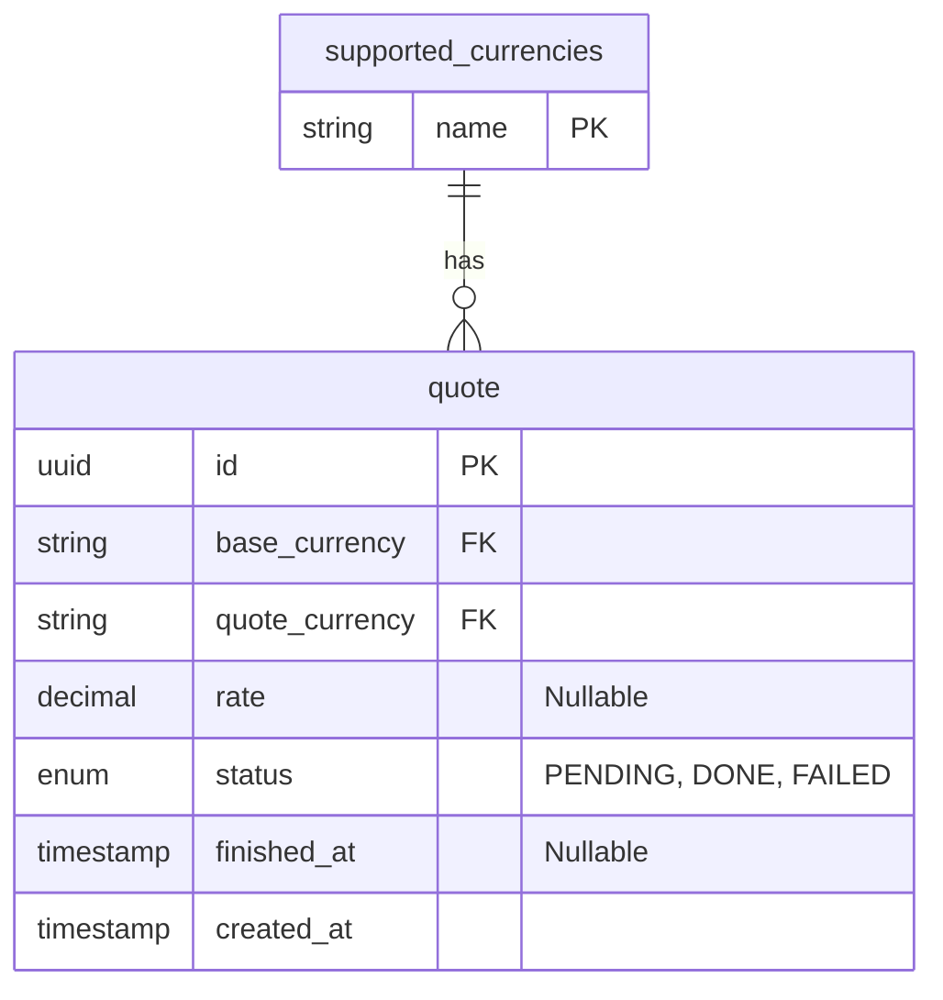

# Plata Currency Exchange

**Make sure your Go version is 1.27.1 or above and Docker is running**

## Launch and startup

1. Set `.env` file in `./configs` directory

    You can copy `.env.template` to `.env` in `./configs` directory

   **Important: You need exchange rates api key from [Exchange Rates API](https://exchangeratesapi.io)** 

2. Use `Makefile` for build and run commands.
   - `make all` and then `make run` will start the server locally
   - `make clean` removes 
   - `make compose-up` for service start via **Docker Compose** and `make compose-down` for removal

## Testing

Postman Collection is here [collection](./docs/plata_exchange_rate_api_collection.json)
You can import collection and use collection variables for testing.

- POST - Update quote
  `http://localhost:8080/quote`

  request body

  ```json
  {
    "base_currency": "{{base_currency}}", // base
    "quote_currency": "{{quote_currency}}" // quote
  }
  ```

  response

  ```json
  {
    "ID": "01a11f34-0bcc-7849-b290-7c2ace9a1974", // this is ID we need for get quote by id
    "Base": "EUR",
    "Quote": "KZT"
  }
  ```

- GET - Get Quote By Id `http://localhost:8080/quote/{{uuid}}`

  response if job done

  ```json
  {
    "ID": "01a11f34-0bcc-7849-b290-7c2ace9a1974",
    "Base": "EUR",
    "Quote": "KZT",
    "Rate": 504.820294,
    "Status": "DONE",
    "FinishedAt": "2026-10-09T10:47:47.494326+05:00",
    "CreatedAt": "2026-10-09T10:47:47.02278+05:00"
  }
  ```

- GET - Get Latest Value By Code `http://localhost:8080/currency?base={{base_currency}}&quote={{quote_currency}}`

  response is the same value as get quote by id but we are passing currency codes

  ```json
  {
    "ID": "01a11f34-0bcc-7849-b290-7c2ace9a1974",
    "Base": "EUR",
    "Quote": "KZT",
    "Rate": 504.820294,
    "Status": "DONE",
    "FinishedAt": "2026-10-09T10:47:47.494326+05:00",
    "CreatedAt": "2026-10-09T10:47:47.02278+05:00"
  }
  ```

## Implementation plan

**For more schemas and thought process also view the [Excalidraw Board](https://excalidraw.com/#json=NV8u3L7LZcTUSrHOrnf3S,EFGMTt0UW9VUWZeOqnXUMA)**

### Project Architecture

In this project i decided to use **global worker pool** for background jobs to bound our service request to amount of request that exchange rate api can handle.

I thought about using crons, but the problem with that it can create latency for users and they will wait job to be processed by next cron tick

Queue (buffer channel) size is intentially big, because we can receive many jobs and workers process them as they will be free

If we send many identical requests for proccessing we lookup from db existing job and send the respond with same uuid which enables idempotency and avoid unnecessary proccessing

### Project structure

As a project structure i choose layered architecture with model (entities), service, handler (controller), and repository (storage) layers. And wire them using dependency injection (via interfaces)

With this setup it would be easy to manage and add new functionality to the codebase initially and also allow to scale as the project grows. And because of dependency injection we can switch internal implementation without breaking other layers.

```
plata-currency-exchange
├── Makefile
├── README.md
├── bin
│   └── exchange-rate   // binary
├── cmd
│   └── main.go         // entrypoint
├── configs
│   └── .env            // env variables (.env.template loaded initially for 0 set-up)
├── go.mod
└── internal
    ├── app
    │   └── app.go      // wires everything
    ├── config
    │   └── config.go   // env config
    ├── handler         // http handlers
    ├── model           // request and response models
    ├── repository      // database operations
    └── service         // business logic
```

### Tools

I want to use standard library packages as much as possible, to make codebase less bloated and keep dependencies low

1. Database: `PostgreSQL` with `github.com/jackc/pgx/v5` as driver and `github.com/pressly/goose/v3` for migrations.
   (As an alternative i would prefer to use `sqlite3` for database because of ease of use and for simple projects like this)
2. Router: Standard `net/http`
3. Env config: `github.com/joho/godotenv` with `github.com/caarlos0/env/v11` for loading and parsing
4. Logging: Standard `log/slog`
5. Containerization: `Docker`

### Database schema



### What i've add to project

Because of deadline i didn't had time to add unit tests for the project. But tests can be easily added thanks to architecture and interfaces which can mock connections.

User authentication and authorization to avoid service abuse and enable rate limiting

Swagger documentation

Currently service layer returns raw errors from db. It's important to make domain errors to be unserstandable for user 