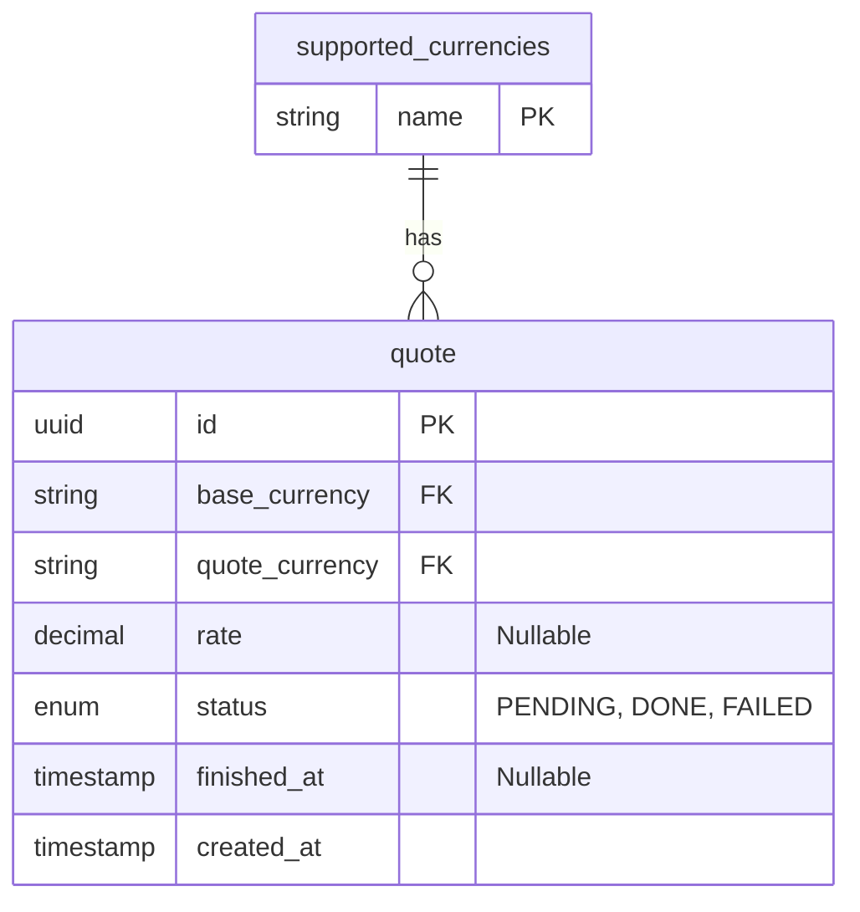

# Plata Currency Exchange

**Make sure your Go version is 1.27.1 or above and Docker is running**

## Launch and build

1. Use `Makefile` for build and run commands.

- `make all` and then `make run` will start the server

## Testing

TODO: Add postman collection here

## Implementation plan

**For more schemas and thought process also view the [Excalidraw Board](https://excalidraw.com/#json=sxA28fw9w8fmw0wAcbWxB,Bqv_NjduPQ9_sEMA-PTSig)**

### Project structure

As a project structure i choose layered architecture with model (entities), service, handler (controller), and repository (storage) layers. And wire them using dependency injection (via interfaces)

With this setup it would be easy to manage and add new functionality to the codebase initially and also allow to scale as the project grows. And because of dependency injection we can switch internal implementation without breaking other layers.

```
plata-currency-exchange
├── Makefile
├── README.md
├── bin
│   └── exchange-rate   // binary
├── cmd
│   └── main.go         // entrypoint
├── cmd
│   └── .env            // env variables (.env.template loaded initially for 0 set-up)
├── go.mod
└── internal
    ├── app
    │   └── app.go      // wires everything
    ├── config
    │   └── config.go   // env config
    ├── handler         // http handlers
    ├── model           // request and response models
    ├── repository      // database operations
    └── service         // business logic
```

### Tools

I want to use standard library packages as much as possible, to make codebase less bloated and keep dependencies low

1. Database: `PostgreSQL` with `github.com/jackc/pgx/v5` as driver and `github.com/pressly/goose/v3` for migrations.
   (As an alternative i would prefer to use `sqlite3` for database because of ease of use and for simple projects like this)
2. Router: Standard `net/http`
3. Env config: `github.com/joho/godotenv` with `github.com/caarlos0/env/v11` for loading and parsing
4. Logging: Standard `log/slog`
5. Cron Jobs: `github.com/robfig/cron/v3` not sure for now. Worker pool seems more interesting because of instant job pickup
6. Containerization: `Docker`

### Database schema



```sql
SELECT rate FROM quote
WHERE status = "DONE" AND base_currency = $1 AND quote_currency = $2
ORDER BY updated_at DESC
LIMIT 1;
```
